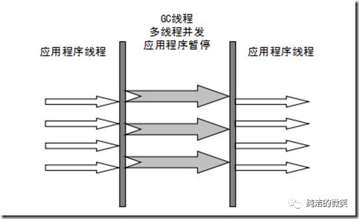

#### 垃圾收集器

> There is a term that you should know before learning about GC. The term is "stop-the-world." Stop-the-world will occur no matter which GC algorithm you choose. Stop-the-world means that the JVM is stopping the application from running to execute a GC. When stop-the-world occurs, every thread except for the threads needed for the GC will stop their tasks. The interrupted tasks will resume only after the GC task has completed. GC tuning often means reducing this stop-the-world time

+ 1 . Serial

  + **复制算法**
  + -XX:+UseSerialGC
  + must not be used on an operating server
  + 新生代的一个单线程的GC
  + *stop-the-world*

+ 2 . ParNew

  + **复制算法**
  + 新生代的收集器
  + *stop-the-world*

+ 3 . Parallel Scavenge
  + **复制算法**
  + 新生代收集器
  + 并行收集，面向吞吐量要求
  + *stop-the-world*
---
+ 4 . Serial Old
  + **标记-整理算法**
  + 老年代收集器版本，单线程
  + *stop-the-world*

+ 5 . Parallel Old
  + **标记-整理算法**
  + Parallel Scavenge收集器的老年代版本
  + *stop-the-world*

+ 6 . CMS

  + **标记-清除算法**
  + 老年代收集器
  + -XX:ParallelCMSThreads=
  + -XX:+UseConcMarkSweepGC
  + *初始化标记和重新标记两个阶段仍然会发生stop-the-world*

+ 7 . G1(Garbage First)
  * -XX:+UseG1GC
  * G1将整个堆划分为多个大小相等的独立区域
  * 保留新生代和老年代的分代概念(但两者不再是物理隔离的)
  * 从整体来看是基于**标记整理算法**，从局部（两个Region之间）来看是**基于复制算法**
  * 使用多个GC线程，每次优先回收价值最大的Region

+ 搭配问题
  + 有一个分代式GC框架，Serial/Serial Old/ParNew/CMS都在这个框架内
  + ParallelScavenge与G1则不在这个框架内，而是各自采用了自己特别的框架。这是因为新的GC实现时发现原本的分代式GC框架用起来不顺手
  + **JVM仅指定新生代垃圾收集器的情况下，默认老年代采用Serial Old垃圾收集器（带压缩）**
    + -XX:+UseSerialGC  
      Serial (DefNew) + Serial Old（Serial Mark Sweep Compact）
    + -XX:+UseParNewGC  
      Parallel (ParNew) + Serial Old（Serial Mark Sweep Compact） 
    + -XX:+UseParallelGC  
      Parallel Scavenge (PSYoungGen) + Serial Old（Serial Mark Sweep Compact (PSOldGen)） 
      > 注：在Parallel Scavenge收集器架构中本身有PS MarkSweep收集器来进行老年代收集，但由于PS MarkSweep与Serial Old实现非常接近，因此官方的许多资料都直接以Serial Old代替PS MarkSweep进行讲解。
    + Parallel Old（带压缩）只能与Parallel Scavenge进行组合  
      -XX:+UseParallelOldGC  
      Parallel Scavenge (PSYoungGen) + Parallel Mark Sweep Compact (ParOldGen)
  + CMS（不带压缩）可以与Serial和ParNew进行组合，共2种组合
    + -XX:-UseParNewGC -XX:+UseConcMarkSweepGC  
      Serial (DefNew) + CMS（Concurrent Mark Sweep）
    + -XX:+UseParNewGC -XX:+UseConcMarkSweepGC  
      Parallel (ParNew) + CMS（Concurrent Mark Sweep） + Serial Old（Serial Mark Sweep Compact）

  
  + 总结
    - Serial Old(MSC)可以与所有新生代收集器进行组合，共3种组合
    - Parallel Old（带压缩）只能与Parallel Scavenge进行组合
    - CMS（不带压缩）可以与Serial和ParNew进行组合，共2种组合

+ 推荐使用的2种GC组合

  
  + 1.基于低停顿时间的垃圾收集器  
    -XX:+UseConcMarkSweepGC（该参数隐式启用-XX:+UseParNewGC）
  + 2.基于吞吐量优先的垃圾收集器  
    -XX:+UseParallelOldGC（该参数隐式启用-XX:+UseParallelGC）

+ 9 . 对比

https://juejin.im/post/5c27ab426fb9a049be5d9318