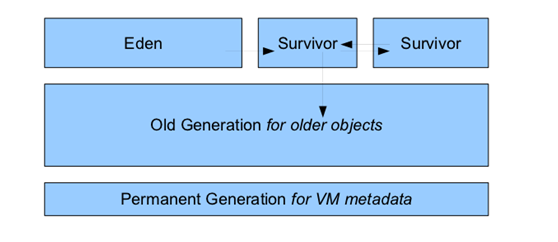
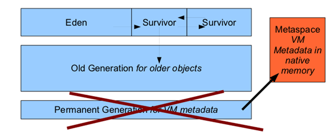
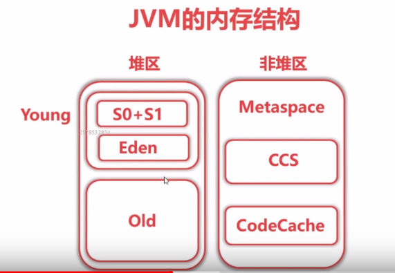

#### 堆结构

#jdk7

+ 永久代的垃圾回收和老年代的垃圾回收是绑定的
+ 字符串常量池的字符串被存储在永久代中
+ JVM堆内存包括Java堆区域 和 永久代区域。因此，永久代不属于Java堆

#jdk8

  
+ jvm内存分两块
  + 堆
    + young
      - eden
      - s0+s1
    + old
  + 非堆
    + metaspace(class,package,field,字节码,常量池,符号引用等)
      - ccs`Compressed class space`(32位指针的class)
        - 演示方法关闭-XX:-UseCompressedClassPointers(jstat -gc pid)
          - ccs的值为0,对象指向class的指针以长指针存在metaspace中
      - CodeCache(JIT编译后的本地代码,JNI使用的C代码)
        - 演示方法使用-Xint(jstat -gc pid)
          - metaspace变小,因为解释执行后没有codecache

+ 新生代GC：minor GC
+ 老年代GC：major GC(或者full GC)