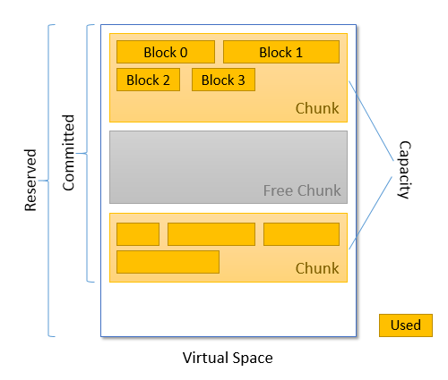
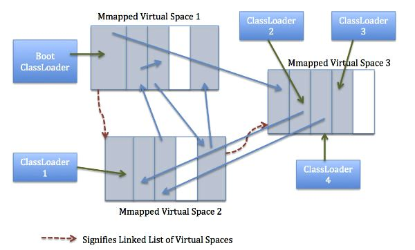

#### metaspace

[参考文档](https://stackoverflow.com/questions/40891433/understanding-metaspace-line-in-jvm-heap-printout)

* Metaspace consists of one or more **Virtual Spaces**. Virtual Spaces are areas of contiguous address space obtained from the OS. They are allocated on demand. When allocated, Virtual Space reserves memory from the OS, but not yet commits it. Metaspace reserved memory is the total size of all Virtual Spaces.

* Allocation unit inside Virtual Space is Metachunk (or simply Chunk). When a new chunk is allocated from a Virtual Space, the corresponding memory is committed. Metaspace committed memory is the total size of all chunks.

* Chunks may differ in size. When a ClassLoader gets garbage collected, all Metachunks belonging to it are freed. Free chunks are maintained in the global free list. Metaspace capacity is the total size of all allocated (i.e. not free) chunks.

* New chunk allocation

  - Look for an existing free chunk in the free list.
  - If there is no suitable free chunk, allocate a new one from the current Virtual Space.
  - If the current Virtual Space is exhausted, reserve a new Virtual Space.

* Class metadata is allocated within a chunk. Chunk may not contain data from multiple ClassLoaders, but one ClassLoader may have several chunks. Metaspace used is the total size of all class metadata from all chunks.
  - class metadata (class fields, method bytecodes, JIT optimisations, etc)
  - **a chunk is bound to a specific class loader)**  
  - 一个类加载器可能有多个块
  - chunk又称组块
  - 