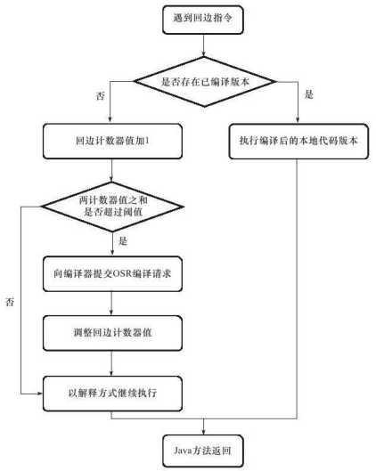

# just in time

**OSR** : 栈上替换(On Stack Replacement,即方法栈帧还在栈上，方法就被替换了)


>回边计数器触发即时编译




>方法调用计数器触发即时编译


+ 编译器
  - 通常将编译分为前端和后端。
  - 其中前端会对程序进行词法分析、语法分析、语义分析，然后生成一个中间表达形式（称为IR：Intermediate Representation）。
    - javac之后生成的就是中间表达形式（.class）
    - JVM在执行时，首先会逐条读取IR的指令来执行
  - 后端再将这个中间表达形式进行优化，最终生成目标机器码
    - 当某一方法调用次数达到即时编译定义的阈值时，就会触发即时编译，这时即时编译器会将IR进行优化，并生成这个方法的机器码，后面再调用这个方法，就会直接调用机器码执行

+ 测试
  - 首先是纯解释执行模式(interpret:解释)
    - -Xint -XX:+PrintCompilation（打印编译信息）
      - 55s左右
  - 纯编译执行模(compile:编译)
    - -Xcomp -XX:+PrintCompilation
      - 1762ms左右
  - 混合模式
    - -XX:+PrintCompilation
      - 1363ms左右


+ CodeCache
  - -XX:InitialCodeCacheSize：CodeCache初始内存大小，默认2496K
  - -XX:ReservedCodeCacheSize：CodeCache预留内存大小，默认48M
  - 参数查看
    ```cmd
    jinfo -flag ReservedCodeCacheSize 27518
    jinfo -flag InitialCodeCacheSize 27518
    ```
  - jdk8提供了一个启动参数XX:+PrintCodeCache在jvm停止的时候打印出codeCache的使用情况  


